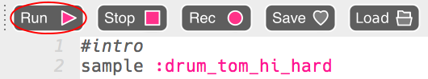

## المقدمة

لنبدأ بإنشاء مقدمة قصيرة عن حلقة الطبل.

+ ابدأ بإضافة العينة `:drum_tom_hi_hard`. إذا بدأت الكتابة ، فيجب أن تكون قادرًا على اختيار العينة من القائمة التي تظهر.
    
    

+ إليك كيفية ظهور التعليمة البرمجية الخاصة بك:
    
    
    
    الخط أعلى العينة يبدأ بـ ` # ` هو **تعليق**. يتم تجاهل هذه الخطوط بواسطة Sonic Pi ، ولكنها مفيدة عندما نريد أن نذكر أنفسنا بما تفعله التعليمة البرمجية الخاص بنا!

+ اضغط على تشغيل ، ويجب أن تسمع عينة طبل.
    
    

+ أضف عينتين أخرى من الأسطوانة ، بحيث تنتقل من الأعلى إلى الأقل. ستحتاج أيضًا إلى` فاصل ` بين كل عينة.
    
    

+ إذا قمت بتشغيل المقدمة الخاصة بك مرة أخرى ، ستسمع أنها بطيئة للغاية. يمكنك إضافة تعليمة برمجية لتغيير الدقات في الدقيقة (** نبضة في الدقيقة ** - لسرعة) الموسيقى.
    
    

+ وأخيرًا ، أضف ` فاصل` و `: drum_splash_hard ` عينة في نهاية المقدمة.
    
    

+ اختبر مدخلك (مقدمة النغمة) مرة أخرى. يجب أن تسمع الآن 3 نغمات، يليها رنة.
    
    

      <audio controls preload> <source src="resources/drums-intro.mp3" type="audio/mpeg"> المتصفح الخاص بك لا يدعم هذا الجزء <code>الصوت </code>. </audio>
    
