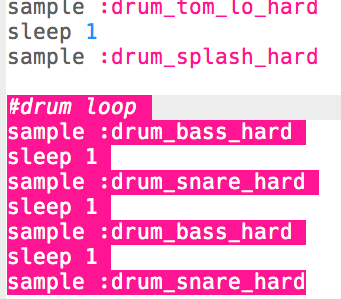

## حلقة الطبل

الآن بعد أن حصلت على مقدمة ، دعنا نبرمج حلقة الطبل الرئيسية!

+ وستتألف حلقة الطبل من 4 عينات بالتناوب بين (صوت الطبل الأدنى) و(صوت الطبل الأعلى).
    
    أضف هذا التعليمة البرمجية**بعد المقدمة الخاصة بك**:
    
    

+ اختبر حلقة الطبل الخاصة بك. يجب أن تسمع 4 دقات طبل بعد المقدمة الخاصة بك.
    
    

    <audio controls preload> 
      <source src="resources/drums-loop-1.mp3" type="audio/mpeg">
    المتصفح الخاص بك لا يدعم هذا الجزء <code>الصوت </code>. 
    </audio>
    

+ يمكنك تكرار حلقة الطبل الخاصة بك عن طريق إضافة `4.times do` قبل الطبول ونهاية `end` في النهاية.
    
    

+ قم بتشغيل الطبول مرة أخرى ، وستلاحظ أنها لا تبدو صحيحة تمامًا. هذا لأنك تحتاج إلى إضافة `فاصل` بعد الطبل النهائي في التعليمة البرمجية تكرار.
    
    

+ اختبر التعليمة البرمجية الخاصة بك مرة أخرى. هذه المرة يجب ان تسمع 4 اصوات وتكرار 4 مرات.
    
    

    <audio controls preload> 
      <source src="resources/drums-loop-2.mp3" type="audio/mpeg">
    المتصفح الخاص بك لا يدعم عنصر <code>الصوت </code>. 
    </audio>
    

+ لجعل حلقة الطبل أكثر إثارة للاهتمام ، يمكنك تشغيل الطبل الثاني **مرتين** ، يدق كل منهما لمدة**0.5** فقط.
    
    

+ اختبر التعليمة البرمجية الخاصة بك مرة أخرى. يجب أن تسمع إيقاعًا مختلفًا.
    
    

    <audio controls preload> 
      <source src="resources/drums-loop-3.mp3" type="audio/mpeg">
    المتصفح الخاص بك لا يدعم هذا الجزء <code>الصوت </code>. 
    </audio>
    
