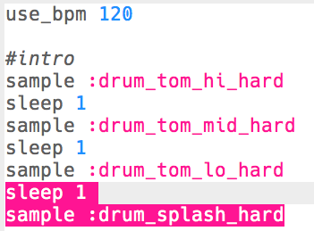

## Introen
Lad os starte med at lave en kort intro til trommeloopet.

+ Start med at tilføje `:drum_tom_hi_hard` samplet. Hvis du begynder med at skrive, burde du få muligheden for at vælge samplet fra en liste, som dukker op.

    

+ Her er hvordan din kode burde se ud:

    

    Linjen over samplet som starter med `#`, er en __kommentar__. Disse linjer er ignoreret af Sonic Pi, men kan bruges til når vi vil påminde os selv omkring, hvad vores kode gør!

+ Tryk run, og du burde høre dit tromme sample.

    

+ Tilføj 2 flere trommesamples, så trommerne går fra høj til lav. Du er også nødt til at lave `sleep` for 1 slag mellem hver sample.

    

+ Hvis du kører din intro igen, vil du høre at den er ret langsom. Du kan tilføje kode til at ændre på musikkens slag pr. minut, eller "beats per minute" (__bpm__ -- hastigheden).

    

+ Tilføj til sidst et `sleep` og et `:drum_splash_hard` sample i slutningen af introen.

    

+ Test din intro igen. Du burde nu høre 3 trommer, efterfuldt af en bæk.

    

    <audio controls preload>
      <source src="resources/drums-intro.mp3" type="audio/mpeg">
    Din browser understøtter ikke <code>audio</code> elementet.
    </audio>
    

