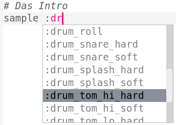

## Das Intro

Zuerst erstellen wir ein kurzes Intro für den Drum-Loop.

+ Füge zuerst ein `: drum_tom_hi_hard` Sample hinzu. Wenn du mit der Eingabe beginnst, kannst du das Sample aus der angezeigten Liste auswählen.
    
    

+ So sollte dein Code aussehen:
    
    
    
    Die Zeile über dem Sample, die mit `#` beginnt, ist ein **Kommentar**. Diese Zeilen werden von Sonic Pi ignoriert, sind aber nützlich, wenn wir uns daran erinnern möchten, was unser Code macht!

+ Clicke den Wiedergabe-Button, der mit "Run" beschriftet ist. Du solltest jetzt dein Sample hören.
    
    

+ Füge 2 weitere Drum-Samples hinzu, so dass sie von hoch nach tief gehen. Zwischen den Samples musst du einen `sleep` Befehl einfügen, damit der Computer wartet und die Samples nacheinander abgespielt werden.
    
    

+ Wenn du dein Intro erneut anhörst, wirst du merken dass es ziemlich langsam ist. Du kannst einen Befehl hinzufügen um die Beats pro Minute (**bpm** - Geschwindigkeit) der Musik zu ändern.
    
    

+ Füge am Ende des Intros noch ein `sleep` und ein `: drum_splash_hard` Sample hinzu.
    
    

+ Spiel dein Intro nochmal ab. Du solltest jetzt 3 Trommeln hören, gefolgt von einem Platsch.
    
    

    <audio controls preload> 
      <source src="resources/drums-intro.mp3" type="audio/mpeg"> 
    Ihr Browser unterstützt das <code>Audio-</code> Element nicht. 
    </audio>
    
