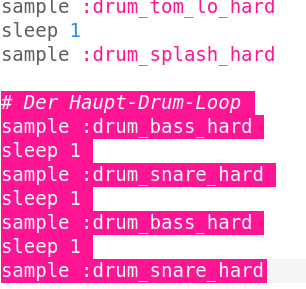
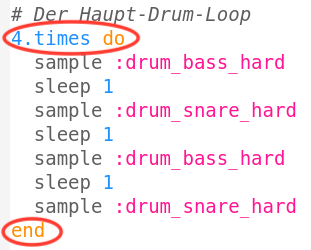
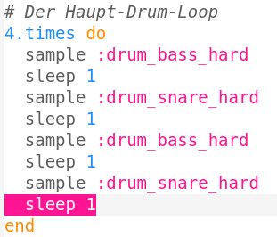
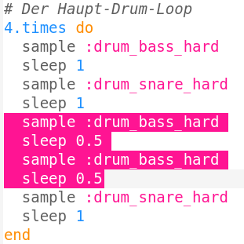

## Der Drum-Loop

Jetzt, da dein Intro fertig ist, schreiben wir den Haupt-Drum-Loop!

+ Der Drum-Loop besteht aus 4 Samples aus abwechselnd Grosser Trommel (der tiefere Schlagzeugton) und der Kleinen Trommel (der höhere Schlagzeugton).
    
    Schreibe diesen Code **unter dein Intro**:
    
    

+ Spiel deinen Drum-Loop ab. Nach dem Intro solltest du 4 Trommelschläge hören.
    
    

    <audio controls preload> 
      <source src="resources/drums-loop-1.mp3" type="audio/mpeg"> 
    Ihr Browser unterstützt das <code>Audio-</code> Element nicht. 
    </audio>
    

+ Du kannst deinen Drum-Loop mehrmals abspielen, indem du `4.times do` vor den Trommelschlägen und am Ende `end` einfügst.
    
    

+ Wenn du den Drum-Loop jetzt abspielst, wirst du hören, dass er nicht ganz richtig klingt. Das liegt daran, dass du nach dem letzten Sample in der Schleife noch ein `sleep` hinzufügen musst.
    
    

+ Spiele deinen Drum-Loop noch einmal ab. Jetzt sollten sich deine 4 Trommelschläge 4 Mal wiederholen.
    
    

    <audio controls preload> 
      <source src="resources/drums-loop-2.mp3" type="audio/mpeg"> 
    Ihr Browser unterstützt das <code>Audio-</code> Element nicht. 
    </audio>
    

+ Damit dein Drum-Loop noch etwas interessanter wird, kannst du die zweite Grosse Trommel **zwei Mal** für jeweils einen **halben** Takt spielen.
    
    

+ Spiele deinen Drum-Loop nochmals ab. Du solltest jetzt einen anderen Rhythmus hören.
    
    

    <audio controls preload> 
      <source src="resources/drums-loop-3.mp3" type="audio/mpeg"> 
    Ihr Browser unterstützt das <code>Audio-</code> Element nicht. 
    </audio>
    
