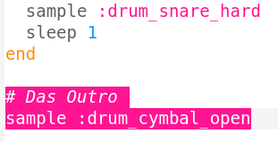

## Das Outro

Jetzt fügen wir dem Drum-Loop noch ein Ende hinzu.

+ Füge ein `:drum_cymbal_open` Sample am Ende deines Programms **außerhalb** der Schleife hinzu.
    
    

+ Klicke den Run-Button, um Dein Programm abzuspielen. Das hört sich nicht sehr interessant an, also fügen wir noch ein `:drum_snare_hard` Sample hinzu.
    
    

+ Teste deinen Code. Beachte, dass es kein `sleep` zwischen den 2 Samples im Outro gibt, so dass sie **gleichzeitig** abgespielt werden.
    
    

    <audio controls preload> 
      <source src="resources/drums-outro.mp3" type="audio/mpeg"> 
    Ihr Browser unterstützt das <code>Audio-</code> Element nicht. 
    </audio>
    
