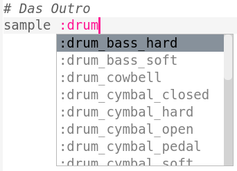
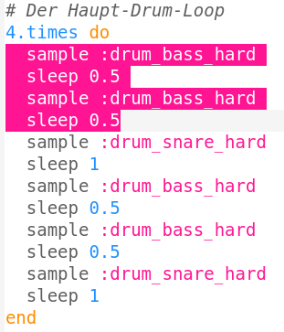
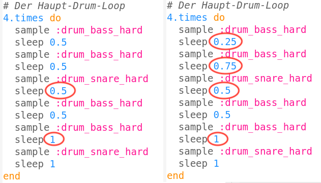

--- challenge ---

## Herausforderung: Erstelle Deinen eigenen Drum-Loop

Kannst du mit dem was du gelernt hast einen eigenen Drum-Loop erstellen? Hier sind einige Vorschläge, die dir helfen können:

+ Verwende andere Drum-Samples in deinem Intro oder Outro. Um zu sehen, welche Samples es gibt, kannst du zu [jumpto.cc/sonic-pi-samples](http://jumpto.cc/sonic-pi-samples) gehen, oder einfach `sample: drum` eingeben und aus der angezeigten Liste auswählen.
    
    

+ Du könntest auch experimentieren, indem du deinem Drum-Loop weitere Samples hinzufügst, die eine kürzere Zeit spielen:
    
    

+ Du könntest auch die `sleep` Befehle zwischen den Samples verändern. Hier sind einige Beispiele zum Ausprobieren:
    
    

--- /challenge ---

***
Dieses Projekt wurde von freiwilligen Helfern übersetzt:

Thomas Angarano

Arnold Marko

Dank freiwilliger Helfer können wir Menschen auf der ganzen Welt die Möglichkeit geben, in ihrer eigenen Sprache zu lernen. Du kannst uns helfen, mehr Menschen zu erreichen, indem Du dich freiwillig zum Übersetzen meldest - weitere Informationen unter [rpf.io/translate](https://rpf.io/translate).