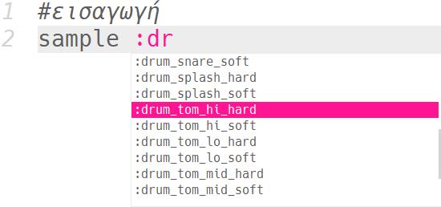
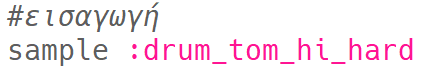
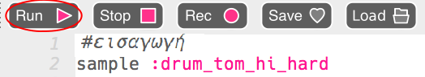
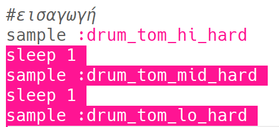
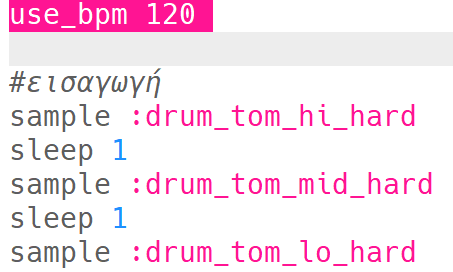
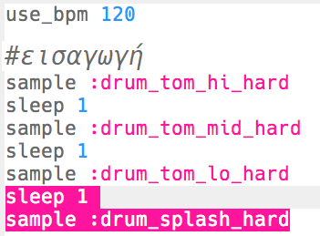

## Η εισαγωγή

Ας ξεκινήσουμε δημιουργώντας έναν απλό βρόχο τύμπανου.

+ Ξεκίνα προσθέτοντας το δείγμα `:drum_tom_hi_hard`. Εάν ξεκινήσεις να πληκτρολογείς, θα πρέπει να μπορείς να επιλέξεις το δείγμα από τη λίστα που εμφανίζεται.
    
    

+ Έτσι πρέπει να φαίνεται ο κώδικας:
    
    
    
    Η γραμμή πάνω από το δείγμα που ξεκινάει με `#` είναι ένα **σχόλιο**. Αυτές οι γραμμές αγνοούνται από το Sonic Pi, αλλά είναι χρήσιμες όταν θέλουμε να θυμηθούμε τι κάνει ο κώδικάς μας!

+ Πάτησε το run (εκτέλεση) και θα πρέπει να ακούσεις το δείγμα του τυμπάνου σου.
    
    

+ Βάλε 2 ακόμη δείγματα τυμπάνου, έτσι ώστε να κυμαίνονται από υψηλά σε χαμηλά. Θα πρέπει επίσης να περιμένεις (`sleep`) για 1 χτύπο μεταξύ κάθε δείγματος.
    
    

+ Εάν εκτελέσεις ξανά την εισαγωγή σου, θα ακούσεις ότι είναι αρκετά αργή. Μπορείις να προσθέσεις κώδικα για να αλλάξεις τους χτύπους ανά λεπτό (**bpm** -- η ταχύτητα) της μουσικής.
    
    

+ Τέλος, βάλε μια αναμονή `sleep` και ένα δείγμα `:drum_splash_hard` στο τέλος της εισαγωγής.
    
    

+ Test your intro again. You should now hear 3 drums, followed by a cymbal.
    
    

      <audio controls preload> <source src="resources/drums-intro.mp3" type="audio/mpeg"> Your browser does not support the <code>audio</code> element. </audio>
    
