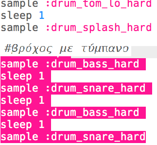
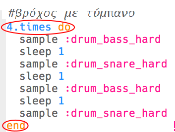
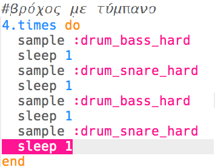
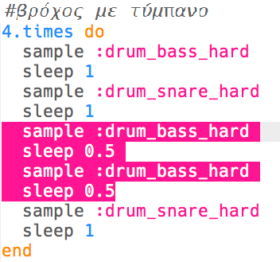

## Ο βρόχος του τυμπάνου

Τώρα που έχεις μια εισαγωγή, ας προγραμματίσουμε τον κύριο βρόχο του τυμπάνου!

+ Ο βρόχος του τυμπάνου θα αποτελείται από 4 δείγματα, εναλλάσσοντας το μπάσο (ο χαμηλότερος ήχος του τυμπάνου) και το ταμπούρο (ο υψηλότερος ήχος του τυμπάνου).
    
    Βάλε αυτόν τον κώδικα **μετά την εισαγωγή**:
    
    

+ Δοκίμασε το βρόχο του τυμπάνου. Θα πρέπει να ακούς 4 ντραμς μετά από την εισαγωγή.
    
    

    <audio controls preload> 
      <source src="resources/drums-loop-1.mp3" type="audio/mpeg"> 
    Το πρόγραμμα περιήγησής σου δεν υποστηρίζει αυτό το <code>ηχητικό</code> στοιχείο. 
    </audio>
    

+ Μπορείς να επαναλάβεις το βρόχο του τυμπάνου προσθέτοντας `4.times do` (κάνε 4 φορές) πριν από τα τύμπανα σου και `end` (τέλος) στο τέλος.
    
    

+ Παίξε ξανά τα ντραμς σου και θα παρατηρήσεις ότι δεν ακούγονται αρκετά σωστά. Αυτό συμβαίνει επειδή πρέπει να προσθέσεις μια αναμονή `sleep` μετά το τελευταίο τύμπανο στο βρόχο.
    
    

+ Δοκίμασε ξανά τον κώδικά σου. Αυτή τη φορά θα πρέπει να ακούσεις τα 4 ντραμς να επαναλαμβάνονται 4 φορές.
    
    

    <audio controls preload> 
      <source src="resources/drums-loop-2.mp3" type="audio/mpeg"> 
    Το πρόγραμμα περιήγησής σου δεν υποστηρίζει αυτό το <code>ηχητικό</code> στοιχείο. 
    </audio>
    

+ Για να κάνεις το βρόχο του τυμπάνου λίγο πιο ενδιαφέροντα, μπορείς να παίξεις το δεύτερο τύμπανο μπάσου **δύο φορές**, για μόλις **0.5** χτύπους το καθένα.
    
    

+ Δοκίμασε ξανά τον κώδικά σου. Θα πρέπει να ακούς ένα διαφορετικό ρυθμό.
    
    

    <audio controls preload> 
      <source src="resources/drums-loop-3.mp3" type="audio/mpeg"> 
    Το πρόγραμμα περιήγησής σου δεν υποστηρίζει αυτό το <code>ηχητικό</code> στοιχείο. 
    </audio>
    
