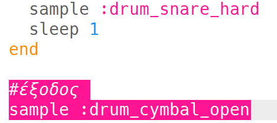
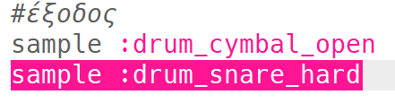

## Η έξοδος

Ας προσθέσουμε ένα τέλος στο βρόχο του τυμπάνου.

+ Πρόσθεσε το δείγμα `:drum_cymbal_open` στο τέλος του κώδικά σου, **έξω** από το βρόχο.
    
    

+ Πάτησε «Run» για να ελέγξεις τον κώδικά σου. Δεν ακούγεται πολύ ενδιαφέρον, οπότε ας προσθέσουμε επίσης ένα δείγμα `:drum_snare_hard`.
    
    

+ Δοκίμασε τον κώδικά σου. Παρατηρήστε ότι δεν υπάρχει αναμονή `sleep` μεταξύ των 2 δειγμάτων εξόδου, οπότε θα παίξουν **ταυτόχρονα**.
    
    

    <audio controls preload> 
      <source src="resources/drums-outro.mp3" type="audio/mpeg"> 
    Το πρόγραμμα περιήγησης σου δεν υποστηρίζει αυτό το <code>ηχητικό</code> στοιχείο. 
    </audio>
    
