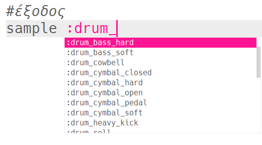
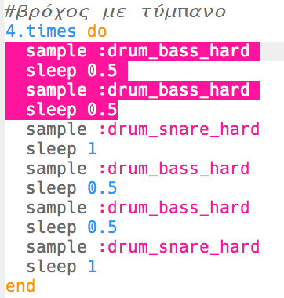
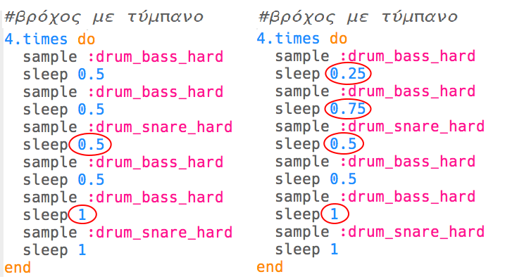

--- challenge ---

## Πρόκληση: Δημιούργησε το δικό σου βρόχο τυμπάνου

Μπορείς να χρησιμοποιήσεις αυτά που έχεις μάθει για να δημιουργήσεις το δικό σου βρόχο τυμπάνου; Ακολουθούν ορισμένες ιδέες που θα σε βοηθήσουν:

+ Θα μπορούσες να αλλάξεις τα δείγματα τυμπάνου που χρησιμοποιούνται στην εισαγωγή ή στην έξοδό σου. Για να δεις ποια δείγματα είναι διαθέσιμα, μπορείς να μεταβείς στη διεύθυνση [jumpto.cc/sonic-pi-samples](http://jumpto.cc/sonic-pi-samples) ή απλώς πληκτρολόγησε `sample :drum` και επέλεξε από τη λίστα που εμφανίζεται.
    
    

+ Θα μπορούσες να πειραματιστείς προσθέτοντας περισσότερα τύμπανα στο βρόχο του τυμπάνου, που παίζουν για μικρότερο χρόνο:
    
    

+ Θα μπορούσες επίσης να παίξεις με την αναμονή `sleep` ανάμεσα στα τύμπανα. Ακολουθούν ορισμένα παραδείγματα που μπορείς να δοκιμάσεις:
    
    

--- /challenge ---

***
Το έργο αυτό μεταφράστηκε από τους εθελοντές:

Αλέξανδρος Ρονιώτης (Σύλλογος ΨηφίΔα)

Ευστάθιος Ιωσηφίδης

Χάρη στους εθελοντές, μπορούμε να δώσουμε σε ανθρώπους σε όλο τον κόσμο την ευκαιρία να μάθουν στη γλώσσα τους. Μπορείτε να μας βοηθήσετε να προσεγγίσουμε περισσότερους ανθρώπους μεταφράζοντας εθελοντικά - περισσότερες πληροφορίες στο [rpf.io/translate](https://rpf.io/translate).