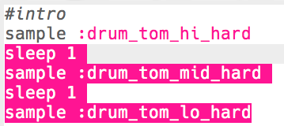

## The intro
Let's start by creating a short intro to the drum loop.

+ Start by adding the `:drum_tom_hi_hard` sample. If you start typing, you should be able to choose the sample from the list that appears.

    

+ Here's how your code should look:

    

    The line above the sample starting with `#` is a __comment__. These lines are ignored by Sonic Pi, but are useful for when we want to remind ourselves what our code does!

+ Press run, and you should hear your drum sample.

    

+ Add 2 more drum samples, so that they go from high to low. You'll also need to `sleep` for 1 beat between each sample.

    

+ If you run your intro again, you'll hear that it's quite slow. You can add code to change the beats per minute (__bpm__ -- the speed) of the music.

    

+ Finally, add a `sleep` and a `:drum_splash_hard` sample at the end of the intro.

    

+ Test your intro again. You should now hear 3 drums, followed by a cymbal.

    

    <audio controls preload>
      <source src="sounds/drums-intro.mp3" type="audio/mpeg">
    Your browser does not support the <code>audio</code> element.
    </audio>
    

### Additional information for club leaders

If you need to print this project, please use the [Printer friendly version](./print).

--- collapse ---
---
title: Club leader notes
---

## Introduction:
In this project, children will learn how to use samples and repetition to create a drum loop.

## Resources
The 'Project Materials' link for this project contains the following resources:

##### Club leader Resources

You can find a completed version of this project by clicking the 'Project Materials' link for this project, which contains:

+ drum-loop.txt
+ drum-loop.mp3

## Learning Objectives
+ Sonic Pi samples
+ Repetition

This project covers elements from the following strands of the [Raspberry Pi Digital Making Curriculum](http://rpf.io/curriculum):

+ [Combine programming constructs to solve a problem.](https://www.raspberrypi.org/curriculum/programming/builder)

## Challenges
+ "Create your own drum loop" - using additional samples to create a personalised drum loop.

## Frequently Asked Questions
+ To find samples available in Sonic Pi, learners can go to <a href="http://jumpto.cc/sonic-pi-samples">jumpto.cc/sonic-pi-samples</a>. Alternatively, they can just type `sample [space]` and choose from the list that appears.

--- /collapse ---

--- collapse ---
---
title: Project materials
---

## Club leader resources
* [Downloadable completed Sonic Pi project](resources/drum-loop.txt)
* [Downloadable completed project mp3 file](resources/drum-loop.mp3)

--- /collapse ---