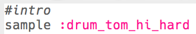

## La intro

Empecemos por crear un bucle de batería.

+ Comienza agregando el sample `:drum_tom_hi_hard`. Si comienzas a escribir, deberías poder elegir el sample de la lista que aparece.
    
    

+ Así es como debe verse tu código:
    
    
    
    La línea superior del sample que comienza con `#` es un **comentario**. Sonic Pi ignora estas líneas, ¡pero son útiles para cuando queremos recordar lo que hace nuestro código!

+ Presiona ejecutar, y deberías escuchar la muestra de tu bateríar.
    
    

+ Añade 2 samples más de batería para que pasen de alto a bajo. También necesitarás `sleep` por 1 tiempo entre cada muestra.
    
    

+ Si vuelves a ejecutar tu introducción, escucharás que es bastante lenta. Puedes añadir código para cambiar los tiempos por minuto (**bpm** -- la velocidad) de la música.
    
    

+ Por último, añade un `sleep` y una muestra `:drum_splash_hard` al final de la intro.
    
    

+ Vuelve a probar tu intro. Ahora deberías escuchar 3 tambores seguidos de un platillo.
    
    

    <audio controls preload> 
      <source src="recursos/bateria-intro.mp3" type="audio/mpeg"> 
    Tu navegador no es compatible con el elemento <code>audio</code>. 
    </audio>
    
