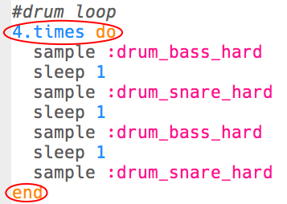

## El bucle de batería

Ahora que tienes la introducción, ¡vamos a programar el bucle de batería principal!

+ El bucle de batería estará compuesto por 4 samples, alternando el bajo (el sonido de batería más bajo) y la caja (el sonido de batería más alto).
    
    Añade este código **después de tu intro**:
    
    

+ Pon a prueba tu bucle de batería. Deberías escuchar 4 golpes de batería después de tu introducción.
    
    

    <audio controls preload> 
      <source src="recursos/bucle-de-bateria1.mp3" type="audio/mpeg"> 
    Tu navegador no es compatible con el elemento <code>audio</code>. 
    </audio>
    

+ Puedes repetir tu bucle de batería añadiendo `4.times do` antes de tu batería y `final` al final.
    
    

+ Reproduce la batería de nuevo y notarás que no suenan bien. Esto es porque necesitas agregar un `sleep` después de la batería final del bucle.
    
    

+ Vuelve a probar tu código. Esta vez deberías escuchar que tus 4 golpes de batería se repiten 4 veces.
    
    

    <audio controls preload> 
      <source src="recursos/bucle-de-bateria2.mp3" type="audio/mpeg"> 
    Tu navegador no es compatible con el elemento <code>audio</code>. 
    </audio>
    

+ Para que tu bucle de batería sea un poco más interesante, puedes tocar el segundo bombo **twice**, por solo **0.5** cada uno.
    
    

+ Vuelve a probar tu código. Deberías escuchar un ritmo diferente.
    
    

    <audio controls preload> 
      <source src="recursos/bucle-de-bateria3.mp3" type="audio/mpeg"> 
    Tu navegador no es compatible con el elemento <code>audio</code>. 
    </audio>
    
