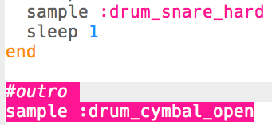

## El outro

Agreguemos un final al bucle de batería.

+ Agrega el sample `:drum_cymbal_open` al final de tu código, **outside** del bucle.
    
    

+ Presiona ejecutar para probar tu código. No suena muy interesante, así que agreguemos también un sample `:drum_snare_hard`.
    
    

+ Prueba tu código. Ten en cuenta que no hay `sleep` entre las 2 muestras del final, así que sonarán al **mismo tiempo**.
    
    

    <audio controls preload> 
      <source src="recursos/baterías-outro.mp3" type="audio/mpeg"> 
    Tu navegador no es compatible con el elemento <code>audio</code>. 
    </audio>
    
