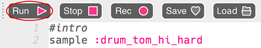
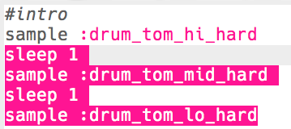
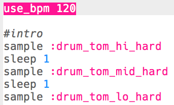

## L'intro

Commençons par créer une courte intro à la boucle de batterie.

+ Commence par ajouter l'échantillon `:drum_tom_hi_hard`. Si tu commences à taper, tu devrais pouvoir choisir l'échantillon dans la liste qui apparaît.
    
    

+ Voici à quoi ton code devrait ressembler :
    
    
    
    La ligne au-dessus de l’échantillon commençant par `#` est un **commentaire**. Ces lignes sont ignorées par Sonic Pi, mais sont utiles lorsque nous voulons nous rappeler ce que fait notre code !

+ Appuie sur « run », et tu devrais entendre ton échantillon de batterie.
    
    

+ Ajoute 2 échantillons de batterie supplémentaires pour qu'ils passent de haut en bas. Tu auras aussi besoin d'un `sleep` pour 1 temps entre chaque échantillon.
    
    

+ Si tu exécutes à nouveau ton intro, tu entendras que c'est assez lent. Tu peux ajouter du code pour changer les battements par minute (**bpm** -- la vitesse) de la musique.
    
    

+ Enfin, ajoute un `sleep` et un échantillon `:drum_splash_hard` à la fin de l'intro.
    
    

+ Teste ton intro à nouveau. Tu devrais maintenant entendre 3 tambours suivis d'une cymbale.
    
    

    <audio controls preload> 
      <source src="resources/drums-intro.mp3" type="audio/mpeg"> 
    Ton navigateur ne supporte pas l'élément <code>audio</code>. 
    </audio>
    
