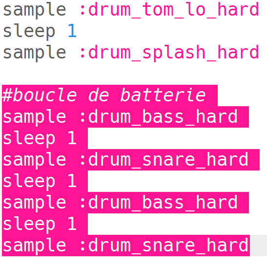
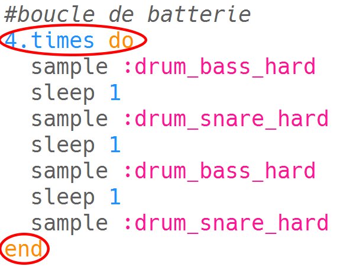
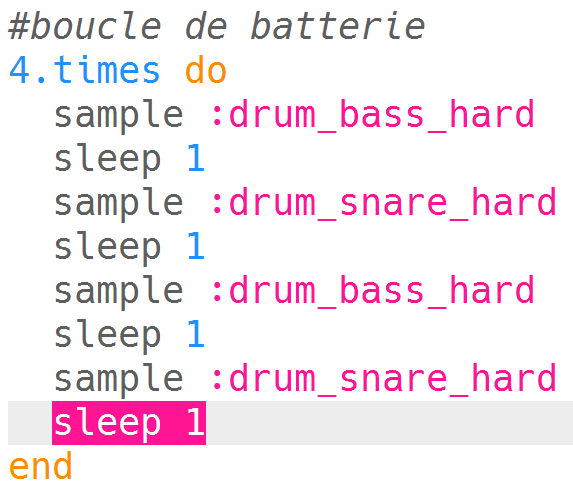
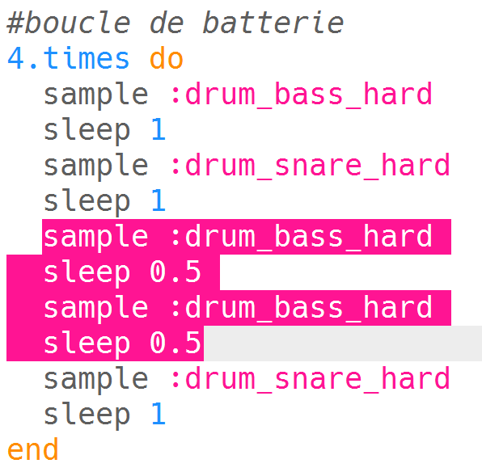

## La boucle de batterie

Maintenant que tu as une intro, codons la boucle principale de la batterie !

+ La boucle de batterie sera composée de 4 échantillons, alternant les basses (le son de batterie inférieur) et la caisse claire (le son de batterie supérieur).
    
    Ajoute ce code **après ton intro**:
    
    

+ Teste ta boucle de batterie. Tu devrais entendre 4 battements de batterie après ton intro.
    
    

    <audio controls preload> 
      <source src="resources/drums-loop-1.mp3" type="audio/mpeg"> 
    Ton navigateur ne supporte pas l'élément <code>audio</code>. 
    </audio>
    

+ Tu peux répéter ta boucle de batterie en ajoutant `4.times do` avant tes tambours et `end` à la fin.
    
    

+ Rejoue tes tambours et tu remarqueras qu'ils ne sont pas tout à fait corrects. C'est parce que tu dois ajouter un `sleep` après le tambour final dans la boucle.
    
    

+ Teste ton code à nouveau. Cette fois, tu devrais entendre tes 4 battements de batterie se répéter 4 fois.
    
    

    <audio controls preload> 
      <source src="resources/drums-loop-2.mp3" type="audio/mpeg"> 
     Ton navigateur ne supporte pas l'élément <code>audio</code>. 
    </audio>
    

+ Pour rendre ta boucle de batterie un peu plus intéressante, tu peux jouer deux fois sur **la deuxième** grosse caisse, pour seulement **0.5** de battements chacun.
    
    

+ Teste ton code à nouveau. Tu devrais entendre un rythme différent.
    
    

    <audio controls preload> 
      <source src="resources/drums-loop-3.mp3" type="audio/mpeg"> 
    Ton navigateur ne supporte pas l'élément <code>audio</code>. 
    </audio>
    
