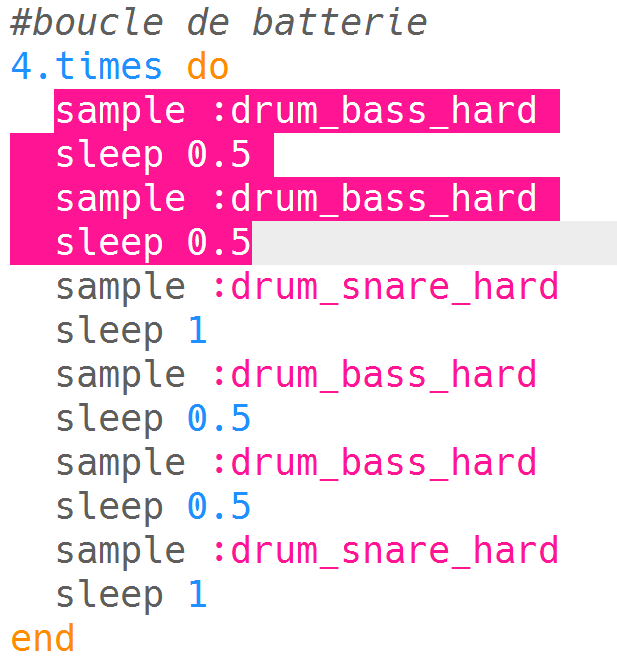
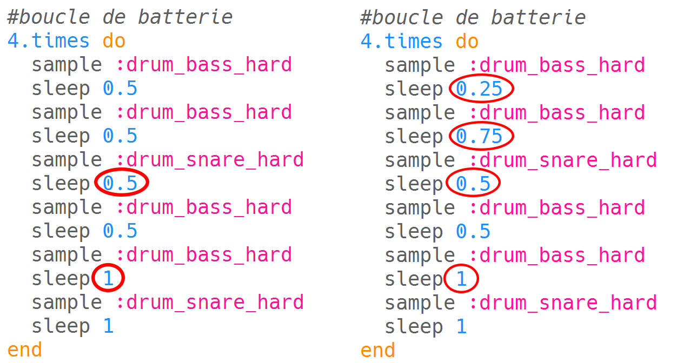

--- challenge ---

## Défi : créer ta propre boucle de batterie

Peux-tu utiliser ce que tu as appris pour créer ta propre boucle de batterie ? Voici quelques idées pour t'aider :

+ Tu peux changer les échantillons de batterie utilisés dans ton intro ou outro. Pour voir quels échantillons sont disponibles, va sur [jumpto.cc/sonic-pi-samples](http://jumpto.cc/sonic-pi-samples), ou tape `sample :drum` et choisis dans la liste qui apparaît.
    
    

+ Tu pourrais expérimenter en ajoutant plus de tambours à ta boucle de batterie qui joue pour un temps plus court :
    
    

+ Tu peux également jouer avec les `sleep`s entre les tambours. Voici quelques exemples que tu peux essayer :
    
    

--- /challenge ---

***
Ce projet a été traduit par des bénévoles:

Michel Arnols

Jonathan Vannieuwkerke

Grâce aux bénévoles, nous pouvons donner aux gens du monde entier la chance d'apprendre dans leur propre langue. Vous pouvez nous aider à atteindre plus de personnes en vous portant volontaire pour la traduction - plus d'informations sur [rpf.io/translate](https://rpf.io/translate).