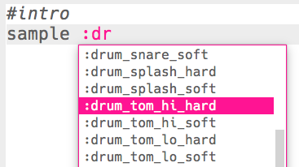
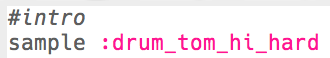

## प्रारंभ

आइए हम ड्रम लूप के लिए एक संक्षिप्त प्रारंभ तैयार करके शुरू करें।

+ `:drum_tom_hi_hard` नमूने को जोड़कर शुरू करें। यदि आप टाइप करना शुरू करते हैं, तो जो सूची दिखाई देती है आपको उसमें से नमूना चुनने में सक्षम होना चाहिए।
    
    

+ यहाँ दिखाया गया है कि आपका कोड कैसा दिखेगा:
    
    
    
    नमूने के ऊपर `#` से शुरू होने वाली पंक्ति **टिप्पणी** है। इन पंक्तियों को Sonic Pi द्वारा अनदेखा किया जाता है, लेकिन ये तब उपयोगी होती हैं जब हम खुद को याद दिलाना चाहते हैं कि हमारा कोड क्या करता है!

+ Run दबाएँ, और आपको अपने ड्रम का नमूना सुनाई देना चाहिए।
    
    

+ ड्रम के 2 और नमूने जोड़ें, ताकि वे उच्च से निम्न तक जाएँ। आपको प्रत्येक नमूने के बीच 1 बीट के लिए `sleep` की भी आवश्यकता होगी।
    
    

+ यदि आप अपने प्रारंभ को फिर से चलाते हैं, तो आप जो सुनेंगे वह काफी धीमा होगा। आप संगीत की प्रति मिनट बीट (**bpm** -- गति) को बदलने के लिए कोड जोड़ सकते हैं।
    
    

+ अंत में, प्रारंभ के अंत में `sleep` और `:drum_splash_hard` नमूना जोड़ें।
    
    

+ अपने प्रारंभ का फिर से परीक्षण करें। अब आपको 3 ड्रम सुनाई देने चाहिए, उसके बाद एक झांझ।
    
    

      <audio controls preload> <source src="resources/drums-intro.mp3" type="audio/mpeg"> आपका ब्राउज़र <code>audio</code> तत्व का समर्थन नहीं करता है। </audio>
    
