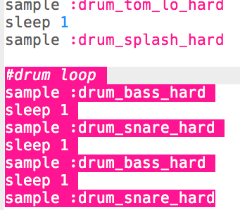
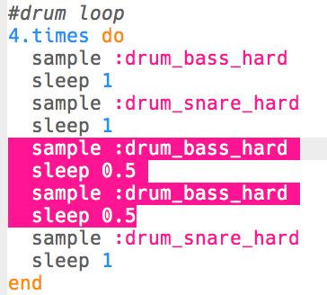

## ड्रम लूप

अब जब आपके पास प्रारंभ है, तो आइए हम मुख्य ड्रम लूप को कोड करें!

+ ड्रम लूप 4 नमूनों से बना होगा, जिसमें बारी-बारी से बास (धीमी ड्रम ध्वनि) और स्नेयर (तेज़ ड्रम ध्वनि) होगी।
    
    इस कोड को जोड़ें **अपने प्रारंभ के बाद**:
    
    

+ अपने ड्रम लूप का परीक्षण करें। अपने प्रारंभ के बाद आपको 4 ड्रम बीट सुनाई देने चाहिए।
    
    

      <audio controls preload> <source src="resources/drums-loop-1.mp3" type="audio/mpeg"> आपका ब्राउज़र <code>audio</code> तत्व का समर्थन नहीं करता है। </audio>
    

+ आप अपने ड्रम से पहले `4.times do` और अंत में `end` जोड़कर अपने ड्रम लूप को दोहरा सकते हैं।
    
    

+ अपने ड्रम फिर से बजाएँ, और आप देखेंगे कि उनकी आवाज़ बिल्कुल सही नहीं है। ऐसा इसलिए है क्योंकि आपको लूप में अंतिम ड्रम के बाद एक `sleep` जोड़ने की आवश्यकता है।
    
    

+ अपने कोड का फिर से परीक्षण करें। इस बार आपको अपने 4 ड्रम बीट 4 बार दोहराते हुए सुनाई देने चाहिए।
    
    

      <audio controls preload> <source src="resources/drums-loop-2.mp3" type="audio/mpeg"> आपका ब्राउज़र <code>audio</code> तत्व का समर्थन नहीं करता है। </audio>
    

+ अपने ड्रम लूप को थोड़ा और दिलचस्प बनाने के लिए, आप दूसरे बास (मंद्र) ड्रम को **दो बार** बजा सकते हैं, प्रत्येक में केवल **0.5** बीट होने पर।
    
    

+ अपने कोड का फिर से परीक्षण करें। आपको एक अलग लय सुनाई देनी चाहिए।
    
    

      <audio controls preload> <source src="resources/drums-loop-3.mp3" type="audio/mpeg"> आपका ब्राउज़र <code>audio</code> तत्व का समर्थन नहीं करता है। </audio>
    
