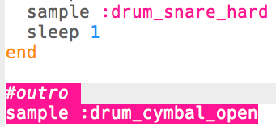

## समापन

आइए हम ड्रम लूप में एक अंत जोड़ें।

+ अपने कोड के अंत में `:drum_cymbal_open` नमूना जोड़ें, लूप के **बाहर**।
    
    

+ अपने कोड की जाँच करने के लिए 'Run' दबाएँ। यह बहुत दिलचस्प नहीं लगता है, तो आइए हम एक `:drum_snare_hard` नमूना भी जोड़ दें।
    
    

+ अपने कोड का परीक्षण करें। ध्यान दें कि 2 समापन नमूनों के बीच कोई `sleep` नहीं है, इसलिए वे **एक ही समय पर** बजेंगे।
    
    

    <audio controls preload> 
        <source src="resources/drums-outro.mp3" type="audio/mpeg"> 
    आपका ब्राउज़र <code>audio</code> तत्व का समर्थन नहीं करता है। 
    </audio>
    
