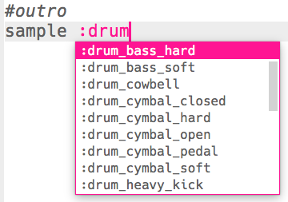
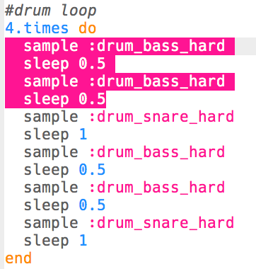

\--- challenge \---

## चुनौती: अपना खुद का ड्रम लूप बनाना

आपने जो कुछ सीखा है क्या आप उसका अपना खुद का ड्रम लूप बनाने के लिए उपयोग कर सकते हैं? यहाँ आपकी मदद के लिए कुछ विचार दिए गए हैं:

+ आप अपने प्रारंभ या समापन में इस्तेमाल किए गए ड्रम के नमूनों को बदल सकते हैं। यह देखने के लिए कि कौन से नमूने उपलब्ध हैं, आप [jumpto.cc/sonic-pi-samples](http://jumpto.cc/sonic-pi-samples) पर जा सकते हैं, या बस टाइप करें `sample :drum` और दिखाई देने वाली सूची में से चुनें।
    
    

+ आप अपने ड्रम लूप में कम समय के लिए बजने वाले अधिक ड्रम जोड़कर प्रयोग कर सकते हैं:
    
    

+ आप ड्रमों के बीच `sleep` के साथ भी कुछ नया प्रयोग कर सकते हैं। यहाँ कुछ उदाहरण दिए गए हैं जिन्हें आप आज़मा सकते हैं:
    
    

\--- /challenge \---