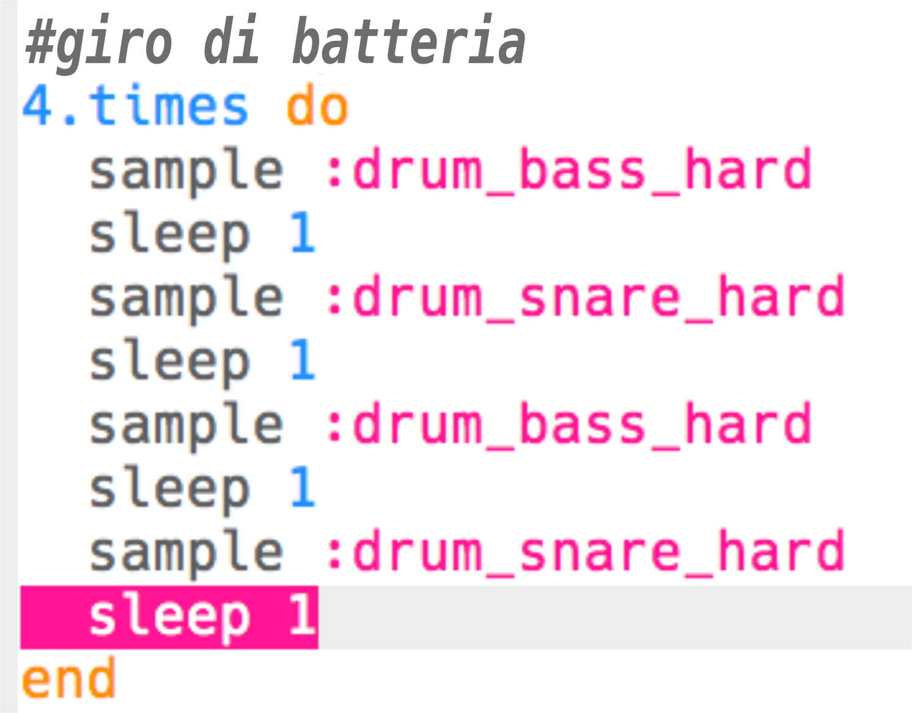

## Il giro di batteria

Ora che hai un'introduzione, creiamo il codice del giro di batteria principale!

+ Il giro di batteria sarà composto da 4 campioni, alternando i bassi (il suono di batteria più basso) e il rullante (il suono di batteria più alto).
    
    Aggiungi questo codice **dopo la tua intro**:
    
    

+ Prova il tuo giro di batteria. Dovresti sentire 4 colpi di tamburo dopo la tua intro.
    
    

      <audio controls preload> <source src="resources/drums-loop-1.mp3" type="audio/mpeg"> Il tuo browser non supporta l'<code>audio</code>. </audio>
    

+ Puoi ripetere il tuo giro di batteria aggiungendo `4.times do` prima dei tamburi e `end` alla fine.
    
    

+ Riproduci di nuovo la batteria, e noterai che non suonano in modo corretto. Questo perché è necessario aggiungere uno `sleep` dopo il tamburo finale all'interno del ciclo.
    
    

+ Prova di nuovo il tuo codice. Questa volta dovresti sentire i tuoi 4 tamburi ripetersi 4 volte.
    
    

      <audio controls preload> <source src="resources/drums-loop-2.mp3" type="audio/mpeg"> Il tuo browser non supporta l'<code>audio</code>. </audio>
    

+ Per rendere il tuo giro di batteria un po' più interessante, puoi suonare la seconda grancassa **due volte**, per **0.5 ** battute ciascuna.
    
    

+ Prova di nuovo il tuo codice. Dovresti sentire un ritmo diverso.
    
    

      <audio controls preload> <source src="resources/drums-loop-3.mp3" type="audio/mpeg"> Il tuo browser non supporta l'<code>audio</code>. </audio>
    
