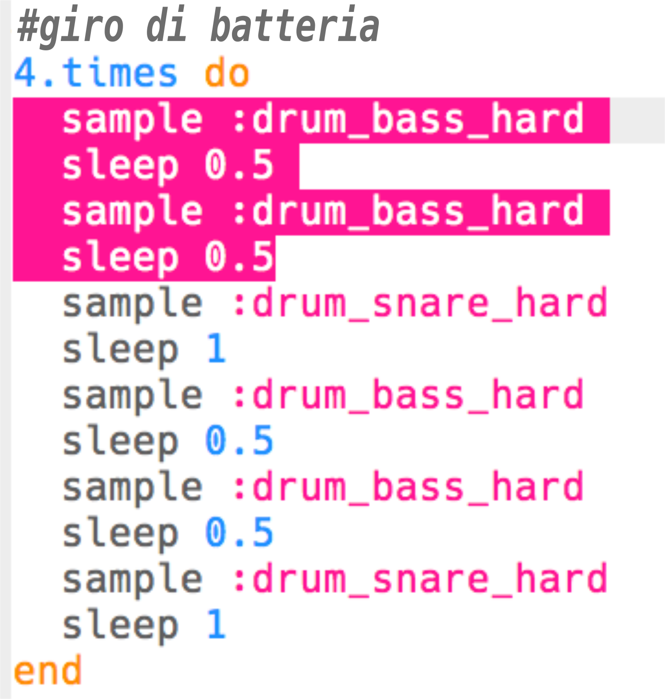
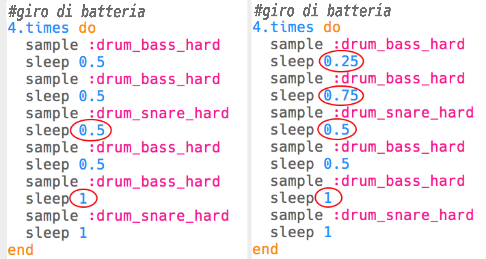

\--- challenge \---

## Sfida: Crea il tuo giro di batteria

Puoi usare quello che hai imparato per creare il tuo giro di batteria? Ecco alcune idee per aiutarti:

+ Potresti modificare i campioni di batteria utilizzati nella tua introduzione o nel finale. Per vedere quali campioni sono disponibili, puoi andare qui [jumpto.cc/sonic-pi-samples](http://jumpto.cc/sonic-pi-samples) oppure digita `sample :drum` e scegli dall'elenco che appare.
    
    

+ Potresti sperimentare aggiungendo più tamburi al tuo giro di batteria, suonandoli per un tempo più breve:
    
    

+ Potresti anche sperimentare con diversi `sleep` tra i colpi di batteria. Here are some examples you can try:
    
    

\--- /challenge \---