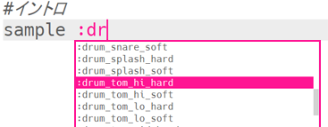
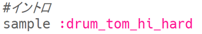
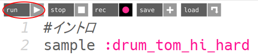
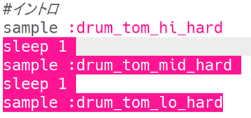
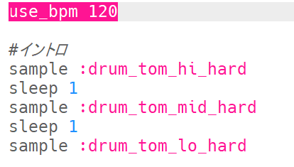
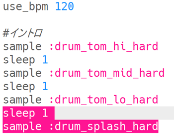

## イントロ

まず、ドラムループの短いイントロから作りましょう。

+ まず、サンプル音源 (おんげん) `:drum_tom_hi_hard`を追加します。 入力し始めると、表示されるリストからサンプル音源 (おんげん) を選べます。
    
    

+ コードは次のようになります。
    
    
    
    sample（サンプル）の上にある`#`で始まる行は**コメント**です。 Sonic Pi はコメントを無視しますが、コードが何をするかを思い出したいときに便利です。

+ run をおすと、ドラムのサンプル音源 (おんげん) が聞こえます。
    
    

+ ハイからローになるように、ドラムのサンプル音源 (おんげん) をさらに2つ追加します。 また、サンプル音源 (おんげん) ごとに1拍 (いっぱく) ずつ `sleep` する (休む) 必要があります。
    
    

+ もう一度イントロを実行すると、かなりおそいことが分かるでしょう。 1分あたりのビート (**bpm** - スピード) を変更するコードを追加しましょう。
    
    

+ 最後に、イントロのいちばん後ろに `sleep` とサンプル音源 (おんげん) `:drum_splash_hard` を追加します。
    
    

+ もう一度テストしてみましょう。 3つのドラムとシンバルの音が聞こえてくるはずです。
    
    

    <audio controls preload> 
      <source src="resources/drums-intro.mp3" type="audio/mpeg"> 
    お使いのブラウザは<code>audio</code>要素をサポートしていません。 
    </audio>
    
