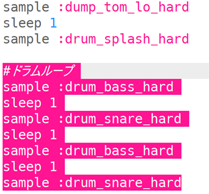
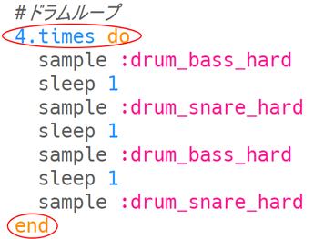
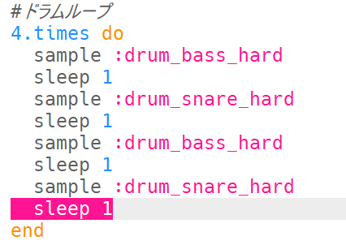
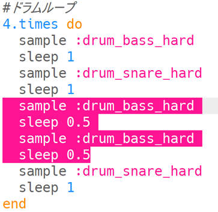

## ドラムループ

イントロができたので、メインのドラムループをコーディングしましょう！

+ ドラムループは4つのサンプル音源 (おんげん) で構成され、ベース (低音) とスネア (高音) をこうごに鳴らします。
    
    **イントロの後ろに**このコードを追加します。
    
    

+ ドラムループをテストしましょう。 イントロの次に4つのドラムの音が聞こえるはずです。
    
    

    <audio controls preload> 
      <source src="resources/drums-loop-1.mp3" type="audio/mpeg"> 
    お使いのブラウザは<code>audio</code>要素をサポートしていません。 
    </audio>
    

+ ドラムループをくり返すには、ドラムの前に`4.times do` (4回くり返す) を、最後に `end` (終わり) を追加します。
    
    

+ もう一度ドラムを鳴らすと、音が少しおかしいことが分かります。 ループの最後のドラムの後に `sleep` を追加する必要があるからです。
    
    

+ もう一度テストしてみましょう。 今度は4つのドラムの音が4回くり返されます。
    
    

    <audio controls preload> 
      <source src="resources/drums-loop-2.mp3" type="audio/mpeg"> 
    お使いのブラウザは<code>audio</code>要素をサポートしていません。 
    </audio>
    

+ 2つ目のバスドラムを**2回**、それぞれ**0.5拍**ずつ鳴らしてドラムループをもう少し楽しくしてみましょう。
    
    

+ もう一度テストしてみましょう。 ちがうリズムが聞こえます。
    
    

    <audio controls preload> 
      <source src="resources/drums-loop-3.mp3" type="audio/mpeg"> 
    お使いのブラウザは<code>audio</code>要素をサポートしていません。 
    </audio>
    
