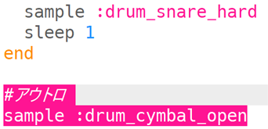

## アウトロ

ドラムループにエンディングを付けましょう。

+ ループの**外側**のコードの最後のところにサンプル音源 (おんげん) `:drum_cymbal_open` を追加します。
    
    

+ run をおしてコードをテストしましょう。 あまり面白くないので、サンプル音源 (おんげん) `:drum_snare_hard` も追加してみましょう。
    
    

+ コードをテストしましょう。 アウトロ用の2つのサンプル音源 (おんげん) の間に `sleep` がないので、2つの音は**同時**に再生されます。
    
    

      <audio controls preload> <source src="resources/drums-outro.mp3" type="audio/mpeg"> お使いのブラウザは<code>audio</code>要素をサポートしていません。 </audio>
    
