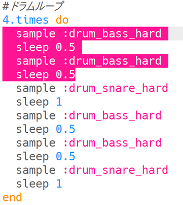

--- challenge ---

## チャレンジ: 自分だけのドラムループを作る

学んだことを使って自分だけのドラムループを作成できますか？ たとえばこんなアイデアがあります。

+ イントロやアウトロで使用するドラムのサンプル音源 (おんげん) を変更できます。 Sonic Pi で利用できるサンプル音源 (おんげん) は、[jumpto.cc/sonic-pi-samples](http://jumpto.cc/sonic-pi-samples) にあります。また、`sample :drum`と入力し、表示されたリストから選ぶこともできます。
    
    

+ より短い時間で鳴るドラムをドラムループに追加してみることもできます。
    
    

+ ドラムの間に `sleep` をはさんで遊んでみるのもいいかもしれませんね。 こんなこともできます。
    
    

--- /challenge ---

***
このプロジェクトは以下のボランティアによって翻訳されました。

松原慧子

齊藤哲哉

ボランティアのおかげで、世界中の人々に母国語で学ぶ機会を与えることができます。翻訳を引き受けていただくことで、より多くの人々に手を差し伸べることができます。詳しくは [rpf.io/translate](https://rpf.io/translate) をご覧ください。