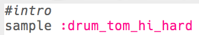

## 인트로 만들기

드럼 루프에 대한 짧은 인트로를 만들어 보겠습니다.

+ `:drum_tom_hi_hard` 샘플을 추가하여 시작해보세요. 입력을 시작하면 나타나는 목록에서 샘플을 선택할 수 있습니다.
    
    

+ 코드는 다음과 같아야 합니다:
    
    
    
    `#`으로 시작하는 코드 한 줄은 **주석**입니다. 이 줄은 Sonic Pi에서 무시되지만, 코드가 수행하는 작업을 메모할 때 유용합니다.

+ run 버튼을 누르면 드럼 샘플이 들릴 것입니다.
    
    

+ 드럼 샘플을 두 개 더 추가하여 하이(높은 음)에서 로우(낮은 음)로 이동하게 합시다. `sleep`을 이용하여 각 샘플 사이를 1박 띄워줍시다.
    
    

+ 인트로를 다시 실행해보면 박자가 상당히 느리다는 것을 확인할 수 있습니다. 분당 비트(**bpm** -- 빠르기)를 변경하는 코드를 추가 할 수 있습니다.
    
    

+ 마지막으로 `sleep` 및 `:drum_splash_hard`를 인트로 끝 부분에 추가합니다.
    
    

+ 코드를 다시 테스트 해 보세요. 이제 드럼 3개와 심벌즈 소리가 들릴 것입니다.
    
    

      <audio controls preload> <source src="resources/drums-intro.mp3" type="audio/mpeg"> 브라우저가 <code>오디오</code>를 지원하지 않습니다. </audio>
    
