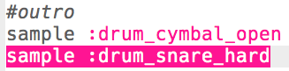

## 아웃트로 만들기

드럼 루프를 마무리해보겠습니다.

+ `:drum_cymbal_open` 샘플을 루프의 **바깥쪽** 끝 부분에 추가하세요.
    
    

+ run 버튼을 눌러 코드를 테스트하세요. 음악이 별로 재밌지 않은 것 같으니 `:drum_snare_hard` 샘플도 추가해봅시다.
    
    

+ 코드를 테스트해 보세요. 아웃트로의 두 샘플 사이에 `sleep`가 없는 것으로 보아 **동시에** 재생될 것임을 알 수 있습니다.
    
    

    <audio controls preload> 
      <source src="resources/drums-outro.mp3" type="audio/mpeg"> 브라우저가 <code>오디오</code>를 지원하지 않습니다. 
    </audio>
    
