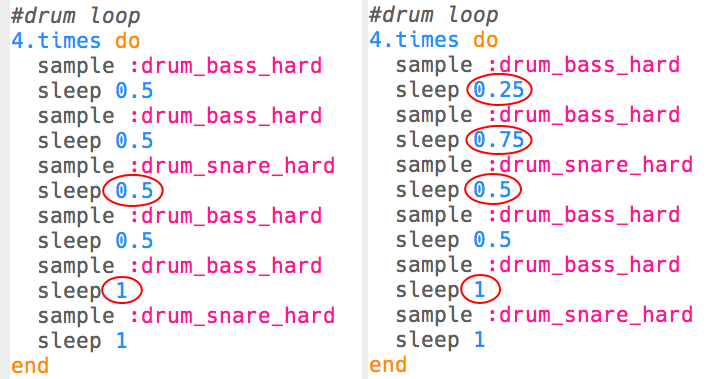

\--- challenge \---

## 도전과제: 나만의 드럼 루프 만들기!

배운 것을 활용하여 자신만의 드럼 루프를 만들 수 있나요? 프로젝트를 진행하는데 도움이 될 사항을 알려드리겠습니다.

+ 인트로 또는 아웃트로에 사용된 드럼 샘플을 변경할 수 있습니다. 사용 가능한 샘플을 확인하려면 [jumpto.cc/sonic-pi-samples](http://jumpto.cc/sonic-pi-samples)로 이동하거나, 그냥 `sample :drum`을 입력한 다음 표시되는 목록에서 선택하면 됩니다.
    
    

+ 드럼 루프에 더 짧은 시간 동안 재생되는 드럼을 추가하여 직접 실험해볼 수 있습니다.
    
    

+ 또는 각 드럼 사이 `sleep`을 가지고 음악을 만들어 봐도 좋습니다. 다음은 시도할 수 있는 몇 가지 예입니다:
    
    

\--- /challenge \---