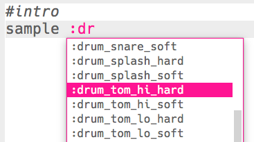

## Het intro

Laten we beginnen met het maken van een korte intro voor de drumloop.

+ Begin met het toevoegen van de `:drum_tom_hi_hard` sample. Als je begint te typen, zou je de sample moeten kunnen kiezen uit de lijst die verschijnt.
    
    

+ Zo zou je code eruit moeten zien:
    
    
    
    De regel boven de sample die begint met `#` is een **commentaar**. Deze regels worden door Sonic Pi genegeerd, maar zijn handig als we ons willen herinneren wat onze code doet!

+ Druk op run en je zou je drumsample moeten horen.
    
    

+ Voeg nog 2 drumsamples toe, zodat ze van hoog naar laag gaan. Je zult ook `sleep` voor 1 maat tussen de samples nodig hebben.
    
    

+ Als je je intro opnieuw uitvoert, hoor je dat het nogal langzaam is. Je kunt code toevoegen om het aantal beats per minuut (**bpm** -- de snelheid) van de muziek te wijzigen.
    
    

+ Voeg ten slotte een `sleep` en een `:drum_splash_hard` sample toe aan het einde van het intro.
    
    

+ Test je intro opnieuw. Je zou nu 3 drums moeten horen, gevolgd door een bekken.
    
    

    <audio controls preload> 
      <source src="resources/drums-intro.mp3" type="audio/mpeg"> 
    Je browser ondersteunt het <code>audio</code>-element niet. 
    </audio>
    
