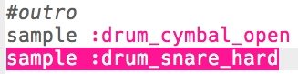

## Het outro

Laten we een einde aan de drumloop toevoegen.

+ Voeg de `:drum_cymbal_open` sample toe aan het einde van je code, **buiten** de loop.
    
    

+ Druk op run om je code te testen. Het klinkt niet erg interessant, dus laten we ook een `:drum_snare_hard` sample toevoegen.
    
    

+ Test je code. Merk op dat er geen `sleep` is tussen de 2 outro samples zodat ze **gelijktijdig** spelen.
    
    

    <audio controls preload> 
      <source src="resources/drums-outro.mp3" type="audio/mpeg"> 
    Je browser ondersteunt het <code>audio</code>-element niet. 
    </audio>
    
