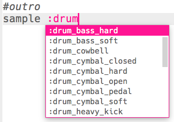

\--- challenge \---

## Challenge: Create your own drum loop

Can you use what you've learnt to create your own drum loop? Here are some ideas to help you:

+ You could change the drum samples used in your intro or outro. Om te zien welke voorbeelden beschikbaar zijn, kun je naar [jumpto.cc/sonic-pi-samples](http://jumpto.cc/sonic-pi-samples), of typ je gewoon `sample :drum` en kies uit de lijst die verschijnt.
    
    

+ You could experiment by adding more drums to your drum loop, that play for a shorter time:
    
    

+ You could also play around with the `sleep`s between drums. Here are some examples you can try:
    
    

\--- /challenge \---