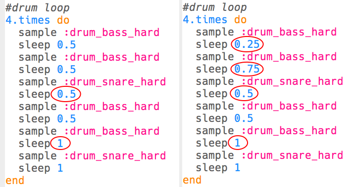

--- challenge ---

## Uitdaging: maak je eigen drumloop

Kun je wat je hebt geleerd gebruiken om je eigen drumloop te creëren? Hier zijn enkele ideeën om je te helpen:

+ Je zou de drumsamples die je in je intro of outro gebruikt kunnen veranderen. Om te zien welke samples beschikbaar zijn, kun je naar [jumpto.cc/sonic-pi-samples](http://jumpto.cc/sonic-pi-samples) gaan, of typ je gewoon `sample :drum` en kies je uit de lijst die verschijnt.
    
    

+ Je zou kunnen experimenteren door meer drums aan je drumloop toe te voegen die kortere tijd spelen:
    
    

+ Je zou ook kunnen spelen met de `sleep`s tussen de drums. Hier zijn enkele voorbeelden die je kunt proberen:
    
    

--- /challenge ---

***
Dit project werd vertaald door vrijwilligers:

Robert-Jan Kempenaar

Sanneke van der Meer

Dankzij vrijwilligers kunnen we mensen over de hele wereld de kans geven om in hun eigen taal te leren. Jij kunt ons helpen meer mensen te bereiken door vrijwillig te starten met vertalen - meer informatie op [rpf.io/translate](https://rpf.io/translate).