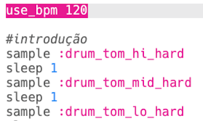

## A introdução

Vamos começar criando uma pequena introdução no loop de bateria.

+ Comece adicionando o sample `:drum_tom_hi_hard`. Se você começar a digitar, você será capaz de escolher o sample da lista que aparece.
    
    

+ Veja como seu código deve ficar:
    
    
    
    A linha acima do sample que começa com `#` é um **comentário**. Essas linhas são ignoradas pelo Sonic Pi, mas são úteis para quando queremos nos lembrar do que nosso código faz!

+ Pressione run, e você deve ouvir seu sample de bateria.
    
    

+ Adicione mais 2 samples de bateria, para que elas vão do agudo (high) para o grave (low). Você também precisará incluir uma pausa `sleep` por 1 batida entre cada sample.
    
    

+ Se você executar sua introdução novamente, ouvirá que está bastante lenta. Você pode adicionar código para alterar as batidas por minuto (**bpm** -- a velocidade) da música.
    
    

+ Por fim, adicione um `sleep` e um sample `:drum_splash_hard` no final da introdução.
    
    

+ Teste sua introdução novamente. Agora você deve ouvir 3 tambores, seguidos por um prato.
    
    

      <audio controls preload> <source src="resources/drums-intro.mp3" type="audio/mpeg"> Seu navegador não suporta o elemento de <code>áudio</code>. </audio>
    
