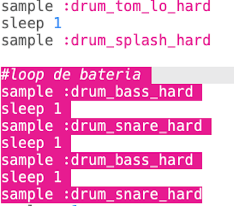
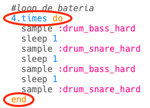
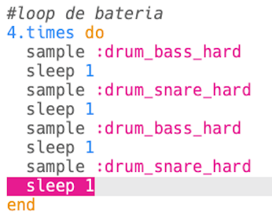
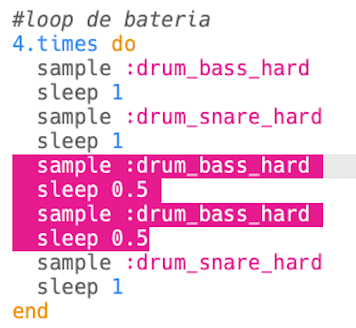

## O loop de bateria

Agora que você tem uma introdução, vamos codificar o loop principal da bateria!

+ O loop de bateria será composto de 4 samples, alternando o bumbo (o som mais grave da bateria) e a caixa (o som mais agudo da bateria).
    
    Adicione este código **após sua introdução**:
    
    

+ Teste seu loop de bateria. Você deve ouvir 4 batidas após a introdução.
    
    

    <audio controls preload> 
      <source src="resources/drums-loop-1.mp3" type="audio/mpeg"> 
    Seu navegador não suporta o elemento de <code>áudio</code>. 
    </audio>
    

+ Você pode repetir o loop da bateria adicionando `4.times do` antes de suas batidas e `end` no fim.
    
    

+ Teste seu loop de bateria novamente e você perceberá que ele não soa muito bem. Isso porque você precisa adicionar um `sleep` após a batida final do loop.
    
    

+ Teste seu código novamente. Desta vez, você deve ouvir suas 4 batidas repetidas 4 vezes.
    
    

    <audio controls preload> 
      <source src="resources/drums-loop-2.mp3" type="audio/mpeg"> 
    Seu navegador não suporta o elemento de <code>áudio</code>. 
    </audio>
    

+ Para tornar seu loop de bateria um pouco mais interessante, você pode tocar o segundo bumbo **duas vezes**, por apenas **0,5** batida cada.
    
    

+ Teste seu código novamente. Você deve ouvir um ritmo diferente.
    
    

    <audio controls preload> 
      <source src="resources/drums-loop-3.mp3" type="audio/mpeg"> 
    Seu navegador não suporta o elemento de <code>áudio</code>. 
    </audio>
    
