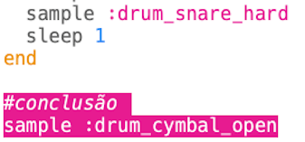
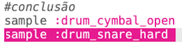

## The outro

Let's add an ending to the drum loop.

+ Add the `:drum_cymbal_open` sample at the end of your code, **outside** of the loop.
    
    

+ Press run to test your code. It doesn't sound very interesting, so let's also add a `:drum_snare_hard` sample.
    
    

+ Test your code. Notice that there's no `sleep` between the 2 outro samples, so they'll play at the **same time**.
    
    

      <audio controls preload> <source src="resources/drums-outro.mp3" type="audio/mpeg"> Your browser does not support the <code>audio</code> element. </audio>
    
