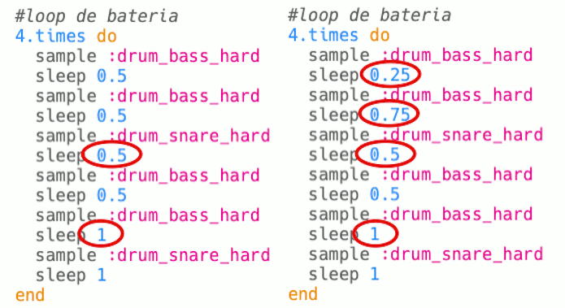

--- challenge ---

## Desafio: Crie seu próprio loop de bateria

Você pode usar o que aprendeu para criar seu próprio loop de bateria? Aqui estão algumas ideias para ajudá-lo:

+ Você pode alterar os samples de bateria usados em sua introdução ou conclusão. Para ver quais samples estão disponíveis, você pode ir para [jumpto.cc/sonic-pi-samples](http://jumpto.cc/sonic-pi-samples) , ou apenas digite `sample: drum` e escolha da lista que aparece.
    
    

+ Você pode experimentar adicionando mais batidas ao seu loop de bateria, que tocam por um tempo mais curto:
    
    

+ Você também pode brincar com os `sleep`s entre as batidas. Aqui estão alguns exemplos que você pode tentar:
    
    

--- /challenge ---

***
Tradução Contribuída pela Comunidade

Este projeto foi traduzido por Marcos Omura e revisado por Douglas Reis.

Nossos incríveis voluntários de tradução nos ajudam a dar as crianças em todo o mundo a oportunidade de aprender a programar. Você pode nos ajudar a alcançar mais crianças traduzindo nossos projetos - leia mais em [rpf.io/translate](https://rpf.io/translate).