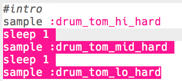

## The intro

Let's start by creating a short intro to the drum loop.

+ Start by adding the `:drum_tom_hi_hard` sample. If you start typing, you should be able to choose the sample from the list that appears.
    
    

+ Here's how your code should look:
    
    
    
    The line above the sample starting with `#` is a **comment**. These lines are ignored by Sonic Pi, but are useful for when we want to remind ourselves what our code does!

+ Press run, and you should hear your drum sample.
    
    

+ Add 2 more drum samples, so that they go from high to low. You'll also need to `sleep` for 1 beat between each sample.
    
    

+ If you run your intro again, you'll hear that it's quite slow. You can add code to change the beats per minute (**bpm** -- the speed) of the music.
    
    

+ Finally, add a `sleep` and a `:drum_splash_hard` sample at the end of the intro.
    
    

+ Test your intro again. You should now hear 3 drums, followed by a cymbal.
    
    

      <audio controls preload> <source src="resources/drums-intro.mp3" type="audio/mpeg"> Your browser does not support the <code>audio</code> element. </audio>
    
