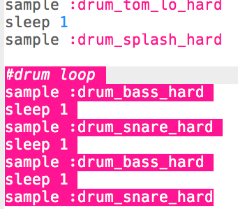

## The drum loop

Now that you have an intro, let's code the main drum loop!

+ The drum loop will be made up of 4 samples, alternating the bass (the lower drum sound) and snare (the higher drum sound).
    
    Add this code **after your intro**:
    
    

+ Test your drum loop. You should hear 4 drum beats after your intro.
    
    

      <audio controls preload> <source src="resources/drums-loop-1.mp3" type="audio/mpeg"> Your browser does not support the <code>audio</code> element. </audio>
    

+ You can repeat your drum loop by adding `4.times do` before your drums and `end` at the end.
    
    

+ Play your drums again, and you'll notice that they don't quite sound right. That's because you need to add a `sleep` after the final drum in the loop.
    
    

+ 再次测试代码。 This time you should hear your 4 drum beats repeat 4 times.
    
    

      <audio controls preload> <source src="resources/drums-loop-2.mp3" type="audio/mpeg"> Your browser does not support the <code>audio</code> element. </audio>
    

+ To make your drum loop a little more interesting, you can play the second bass drum **twice**, for just **0.5** beats each.
    
    

+ 再次测试代码。 You should hear a different rhythm.
    
    

      <audio controls preload> <source src="resources/drums-loop-3.mp3" type="audio/mpeg"> Your browser does not support the <code>audio</code> element. </audio>
    
