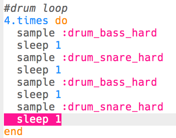

## 鼓循环

现在已经有前奏了，让我们继续编写鼓循环的主代码吧！

+ 鼓循环将由4个示例组成，由低音鼓（较低的鼓声）和小鼓（较高的鼓声）交替发声。
    
    **在你的前奏简介之后**添加此代码 ：
    
    

+ 测试您的鼓点循环。 前奏之后，您应该听到4声鼓声。
    
    

    <audio controls preload> 
      <source src="resources/drums-loop-1.mp3" type="audio/mpeg"> 
    您的浏览器不支持 <code>audio</code> 元素。 
    </audio>
    

+ 您可以通过添加`4.times do`在鼓和`end`末尾之前来重复您的鼓点循环。
    
    

+ 再次播放鼓声，您会发现它们的声音不太正确。 那是因为您需要在循环中的最后一个鼓点之后添加停顿`sleep`。
    
    

+ 再次测试代码。 这次您应该听到4次鼓声重复4次。
    
    

    <audio controls preload> 
      <source src="resources/drums-loop-2.mp3" type="audio/mpeg"> 
    您的浏览器不支持 <code>audio</code> 元素。 
    </audio>
    

+ 为了使你的鼓循环更加有趣，你可以将第二个低点的鼓播放**两次**。每次打**0.5**节拍。
    
    

+ 再次测试代码。 您应该听到不同的节奏。
    
    

    <audio controls preload> 
      <source src="resources/drums-loop-3.mp3" type="audio/mpeg"> 
    您的浏览器不支持 <code>audio</code> 元素。 
    </audio>
    
