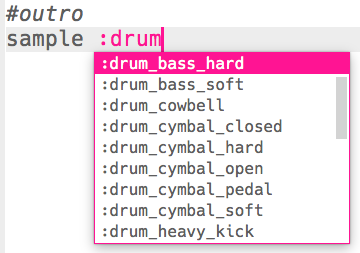

\--- challenge \---

## 挑战：创建自己的鼓曲循环

您可以使用学到的知识来创建自己的鼓循环吗？ 以下是一些可以帮助您的示例：

+ 您可以更改在前奏或结尾中使用的鼓声样本。 要查看可用的样本，请转到[ jumpto.cc/sonic-pi-samples ](http://jumpto.cc/sonic-pi-samples) ，或键入` sample:drum `然后从显示的列表中选择。
    
    

+ 您可以通过在鼓循环中添加更多鼓点来进行试验，以缩短播放时间：
    
    

+ 你也可以在不同的鼓之间用停顿`sleep`来调整。 您可以尝试以下示例：
    
    

\--- /challenge \---